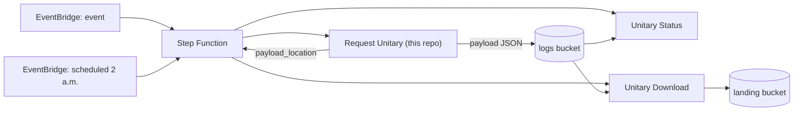
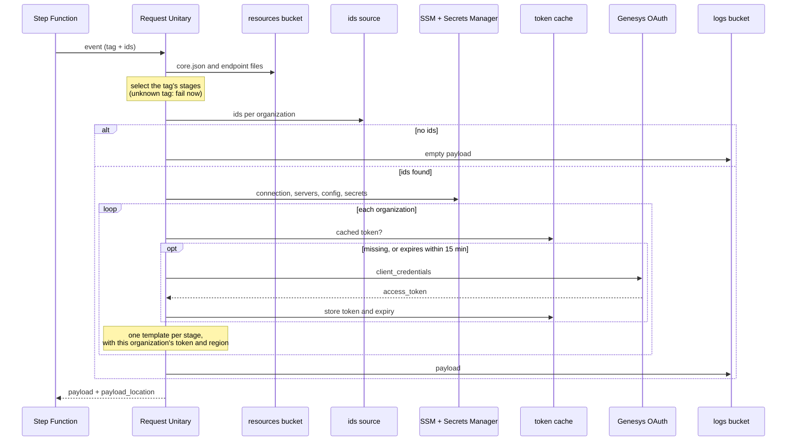
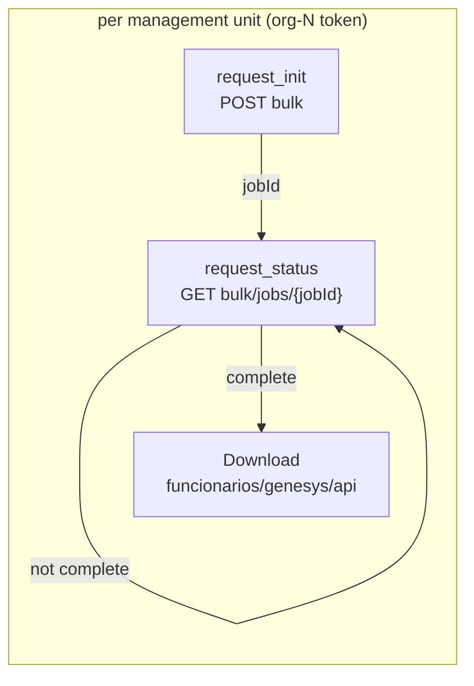

# How Request Unitary works

Request Unitary is the first Lambda of the Genesys Cloud unitary-download
pipeline. It doesn't call the Genesys data APIs itself. It works out **which
calls** a flow needs, **for which ids**, **with which credentials**, and writes
that plan (the payload) where the next Lambdas can execute it.

Contents:

1. [Where it sits](#1-where-it-sits)
2. [One invocation, step by step](#2-one-invocation-step-by-step)
3. [How a flow is defined](#3-how-a-flow-is-defined)
4. [What each flow produces](#4-what-each-flow-produces)
5. [How an organization entry is built](#5-how-an-organization-entry-is-built)
6. [Tokens](#6-tokens)
7. [What stops the run and what is contained](#7-what-stops-the-run-and-what-is-contained)
8. [Code map](#8-code-map)

Event and payload formats, environment variables and deployment are in the
[README](../README.md).

---

## 1. Where it sits

What Request Unitary reads:

| Source | What it provides |
|---|---|
| The event | the **tag** (which flow) and the **ids** per organization, or where to find them |
| `augusta-nexa-<env>-resources` | `core.json` and the endpoint files (`unitary.json`, `status.json`) |
| SSM `/augusta-nexa-<env>/genesys/api` | `connection` (URLs, header template, OAuth settings), `servers` (region per organization), `config` (output prefixes) |
| Secrets Manager, same prefix | each organization's OAuth `client_id` / `client_secret` |
| DynamoDB via the runtime-control layer | cached OAuth tokens |

What it writes: one payload per run to
`augusta-nexa-<env>-logs/transacciones/genesys/api/payload_request_unitary/<tag>/<execution_id>.json`.

---

## 2. One invocation, step by step

| # | Step | What happens | Code |
|---|---|---|---|
| 1 | Settings | Environment token from `ENV_PREFIX` → `ENVIRONMENT` → `PROFILE` → `STACK_ID` (default `dev`); bucket names, SSM path and resource name derive from it. | `config.load_settings` |
| 2 | Execution id | The Lambda request id, or a UUID when there is no Lambda context. | `main.handler` |
| 3 | Tag | `event.tag`, or `event.detail.tag` for EventBridge events. | `sources.resolve_tag` |
| 4 | Stages | Load the `core.json` groups listed in `ENDPOINT_GROUPS`, keep the endpoints carrying this tag, and map each one's `type` to a stage. An unknown tag fails **here**, before any ids are read. | `endpoints.load_endpoint_catalog`, `endpoints.select_stages` |
| 5 | Ids | From `event.organizations`, else the S3 file in `event.ids_location`, else the S3 object named in `event.detail`. Organizations merge, ids are de-duplicated and sorted, organizations without ids are dropped. | `sources.resolve_ids_by_organization` |
| 6 | Genesys config | Once per run, and only if there are ids: `connection`, `servers`, `config` and the OAuth secrets. | `token_manager.load_config` |
| 7 | Output prefix | Pick the prefix the downloaded JSON will be saved under, from the tag's domain. | `payload.output_base_path` |
| 8 | Per organization | Find its `servers` entry → get its token → build one request template per stage. | `main._build_organizations`, `token_manager.get_token`, `payload.build_organization_entry` |
| 9 | Write | Save `{"tag", "organization": [...]}` to the logs bucket. | `s3_utils.write_json` |
| 10 | Return | The payload plus `execution_id`, `payload_location`, `stages`, `failed_organizations`. | `main.handler` |

---

## 3. How a flow is defined

A flow is **data, not code**. It is the set of endpoints in the endpoint files
that carry the same `tag`. Each endpoint's `type` decides which stage it fills,
and stages always come out in this order:

| `type` | Stage | Meaning |
|---|---|---|
| `unitary` | `request_context` | a direct call per id (or an initial listing) |
| `init` | `request_init` | starts an asynchronous job, returns a `jobId` |
| `status` | `request_status` | polled until the job completes |

A flow needs at least one stage and at most one endpoint per stage. Endpoints
without a `tag` belong to no flow.

**To add a flow:**

1. Add or tag its endpoints in the endpoint files (`unitary.json` /
   `status.json`) with the new tag.
2. If its domain isn't `funcionarios` and it shouldn't go under
   `transacciones/genesys/api`, add the domain to
   `OUTPUT_BASE_PATH_KEY_BY_DOMAIN` in [src/payload.py](../src/payload.py).
3. Trigger the Step Function with `{"tag": "<new tag>", ...ids...}`.

No change to this Lambda is needed for step 1. Step 2 is a one-line mapping.

---

## 4. What each flow produces

### `surveys`

| | |
|---|---|
| Ids | Genesys conversation ids, grouped by organization |
| Stages | `request_context`: `GET /api/v2/quality/conversations/{conversationId}/surveys` |
| Saved under | `transacciones/genesys/api` |
| Next | Download calls the template once per conversation id. No job, no polling. |

### `funcionarios_adherencia`

| | |
|---|---|
| Ids | management unit ids, from the 2 a.m. file |
| Stages | `request_init`: `POST /api/v2/workforcemanagement/adherence/historical/bulk` → `request_status`: `GET .../bulk/jobs/{jobId}` |
| Job size | one bulk job per management unit. The body has no `userIds`, so Genesys queries every user in the unit. |
| Saved under | `funcionarios/genesys/api` |
| Next | The init is sent with `{mu_id}`, `{star_date}`, `{end_date}` filled in, Status polls the returned `jobId` until it completes, and Download saves the result. |

Status must poll with the **same organization's** token that started the job:
Genesys only lets the client that started a bulk job query its status. The
per-organization token in each template guarantees that.

---

## 5. How an organization entry is built

Each entry is `{"organization_id", "ids", <one key per stage>}`. Every stage
template is built the same way:

| Field | Built from | Rendered here? |
|---|---|---|
| `base_url` | `connection.base_url` with the server's `region_id` | yes: `https://api.usw2.pure.cloud` |
| `url` | the endpoint's `url` | **no**: `{conversationId}`, `{mu_id}`, `{jobId}` stay for downstream |
| `method` | the endpoint's `method` | n/a |
| `headers` | `connection.header_template` with the organization's `access_token` | yes |
| `payload` | the endpoint's `body_templante` (or `body_template`) | **no** |
| `params` | the endpoint's `params_template` | **no** |
| `type`, `path`, `result_data` | copied from the endpoint | n/a |
| `base_path` | `config.output.base_path_wfm` for `funcionarios_*`, else `config.output.base_path` | n/a |
| `server_path` | the server's `relative_path`, e.g. `org_id=3/` | n/a |

Only what is specific to the **organization** is filled in (region and token).
Everything specific to an **id** is left for the Lambdas that execute the calls.

---

## 6. Tokens

One token per organization per run, however many stages or ids it has:

1. The organization id `org-3` becomes the `servers` key `org_3`, which gives
   `region_id`, `relative_path` and `oauth` (the secret name).
2. The cache key is `<config.output.base_path>/<relative_path>`, e.g.
   `transacciones/genesys/api/org_id=3/`.
3. If DynamoDB holds a token for that key that expires **more than 15 minutes**
   from now, it is reused.
4. Otherwise a new one is requested from `https://login.<region_id>.pure.cloud/oauth/token`
   with that organization's `client_id` / `client_secret`, and stored with its
   expiry.

The cache key always uses `base_path`, even for `funcionarios` flows that save
under `base_path_wfm`. Tokens belong to the organization, not the flow; a
per-flow key would miss the cached token and request a second one.

---

## 7. What stops the run and what is contained

| Situation | Outcome |
|---|---|
| Event without a tag | run fails |
| No endpoints carry the tag; a tagged endpoint's `type` maps to no stage; two endpoints for the same stage | run fails, before ids are read |
| `core.json` lacks a configured group; one endpoint defined differently in two files | run fails |
| Event gives no ids source; an organization entry lacks `organization_id` or `ids` | run fails |
| `config.output` lacks the prefix key for the tag's domain | run fails |
| No ids at all | empty payload written; Genesys and SSM are not called |
| An organization has no `servers` entry | listed in `failed_organizations`; the others continue |
| An organization's token can't be obtained | listed in `failed_organizations`; the others continue |

Configuration problems fail the whole run, since every organization would hit
them. Problems specific to one organization only affect that organization.

---

## 8. Code map

| File | Responsibility |
|---|---|
| [src/main.py](../src/main.py) | `handler`: runs the steps above; `_build_organizations`: the per-organization loop |
| [src/config.py](../src/config.py) | environment variables → `Settings`; bucket and key naming |
| [src/sources.py](../src/sources.py) | the tag and the ids from the event (inline, S3 file, or S3 event) |
| [src/endpoints.py](../src/endpoints.py) | loads the endpoint catalog; selects and orders a tag's stages |
| [src/payload.py](../src/payload.py) | output prefix by domain; builds stage templates, organization entries and the payload |
| [src/token_manager.py](../src/token_manager.py) | Genesys config from SSM; per-organization token: cache, request, store |
| [src/params.py](../src/params.py) | reads SSM parameters and Secrets Manager secrets under a path |
| [src/client_request.py](../src/client_request.py) | HTTP call used for the OAuth token request |
| [src/templates.py](../src/templates.py) | `{placeholder}` rendering over strings, dicts and lists |
| [src/s3_utils.py](../src/s3_utils.py) | read / write JSON in S3 |

Tests mirror these modules one-to-one under `test/`.
