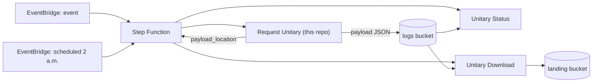
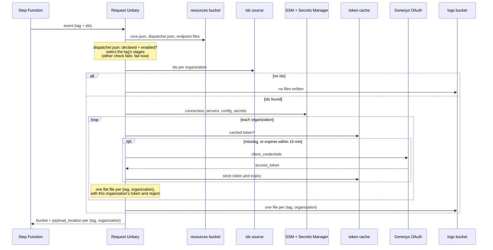
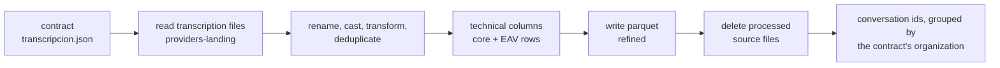
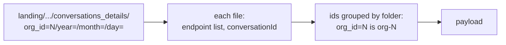
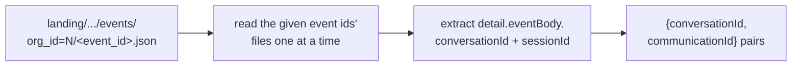
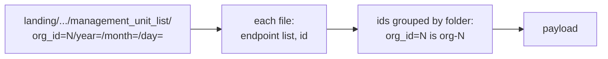
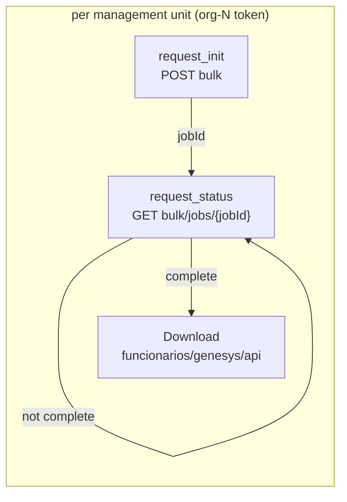

# How Request Unitary works

Request Unitary is the first Lambda of the Genesys Cloud unitary-download
pipeline. It doesn't call the Genesys data APIs itself. It works out **which
calls** a flow needs, **for which ids**, **with which credentials**, and writes
that plan (the payload) where the next Lambdas can execute it.

The ids can come from the event itself, from the **contracts process** (turn the
providers' transcription files into parquet and take the conversation ids from
them), or from the **Genesys conversations download** for a given date (read the
conversation ids only).

Contents:

1. [Where it sits](#1-where-it-sits)
2. [One invocation, step by step](#2-one-invocation-step-by-step)
3. [How a flow is defined](#3-how-a-flow-is-defined)
4. [What each flow produces](#4-what-each-flow-produces)
5. [How an organization entry is built](#5-how-an-organization-entry-is-built)
6. [Tokens](#6-tokens)
7. [What stops the run and what is contained](#7-what-stops-the-run-and-what-is-contained)
8. [Code map](#8-code-map)

Event and payload formats, environment variables and deployment are in the
[README](../README.md).

---

## 1. Where it sits

What Request Unitary reads:

| Source | What it provides |
|---|---|
| The event | the **tag** (which flow) and the **ids** per organization, or where to find them |
| `augusta-nexa-<env>-resources` | `core.json`, `dispatcher.json` (which tags may run, and where their output goes) and the endpoint files (`unitary.json`, `status.json`) |
| SSM `/augusta-nexa-<env>/genesys/api` | `connection` (URLs, header template, OAuth settings), `servers` (region per organization), `config` (output prefixes) |
| Secrets Manager, same prefix | each organization's OAuth `client_id` / `client_secret` |
| DynamoDB via the runtime-control layer | cached OAuth tokens |
| `augusta-nexa-<env>-providers-landing` | transcription files, when the run uses the contracts process |
| `augusta-nexa-<env>-landing`, `conversations_details/` | the day's downloaded conversations, when the run uses that source (read-only) |
| `CONTRACTS_PREFIX` in the resources bucket | the contracts, one per provider/operation |

What it writes: one flat payload file **per organization per tag**, at a
fixed location (not one per execution) that a later run overwrites, to
`augusta-nexa-<env>-logs/transacciones/genesys/api/payload_request_unitary/<tag>/<organization_id>.json`.
With the contracts process it also writes parquet to `augusta-nexa-<env>-refined`
and deletes the transcription files it processed.

---

## 2. One invocation, step by step

| # | Step | What happens | Code |
|---|---|---|---|
| 1 | Settings | Environment token from `ENV_PREFIX` → `ENVIRONMENT` → `PROFILE` → `STACK_ID` (default `dev`); bucket names, SSM path and resource name derive from it. | `config.load_settings` |
| 2 | Execution id | The Lambda request id, or a UUID when there is no Lambda context. | `main.handler` |
| 3 | Tags | `tag` (one) or `tags` (a list, or `"all"`), top-level or under `detail`. | `sources.resolve_tag_selection` |
| 4 | Validate | Load `dispatcher.json` and the endpoint catalog. Expand `"all"` to every enabled flow with `id_kind` `"conversation"`, `"survey"` or `"transcript_session"`. For every tag: it must be declared and enabled in `dispatcher.json`, resolve its output-prefix key from its domain, and have endpoints for each stage it needs. Every tag is checked **here**, before any ids are read. | `dispatcher_config.load_dispatcher_config`, `dispatcher_config.conversation_tags`, `dispatcher_config.flow_config`, `dispatcher_config.output_base_path_key`, `endpoints.load_endpoint_catalog`, `endpoints.select_stages` |
| 5 | Ids | With `"ids_source": "contracts"`: run the [contracts process](#contracts-process-where-surveys-ids-come-from) and group its conversation ids by organization. With `"ids_source": "conversations_details"`: read that `date`'s [conversation files](#conversations-download-ids-without-a-contract) per `org_id=` folder, once per distinct `id_kind` among the tags run. With `"ids_source": "management_unit_list"`: read that `date`'s [management unit files](#genesys-management-units-download-ids-for-management_unit_list) per `org_id=` folder. Otherwise from `event.organizations`, else the S3 file in `event.ids_location`, else the S3 object named in `event.detail`. Organizations merge, ids are de-duplicated and sorted, organizations without ids are dropped. For a `"transcript_event"` tag, whatever ids came out of the step above are then treated as event ids and resolved into `{conversationId, communicationId}` pairs by reading each one's file. | `main._resolve_ids`, `main._resolve_ids_by_kind`, `contracts_process.run_contracts`, `conversations_details.collect_survey_ids`, `conversations_details.collect_transcript_session_ids`, `management_units.collect_management_unit_ids`, `sources.resolve_ids_by_organization`, `transcript_events.resolve_transcript_events` |
| 6 | Date | The event's `date`, when the run used `conversations_details` or `management_unit_list`; otherwise today's date (UTC). Carried as a top-level `date` in every tag's payload file, whatever ids source it used. | `main.run` |
| 7 | Genesys config | Once per run, and only if there are ids: `connection`, `servers`, `config` and the OAuth secrets. | `token_manager.load_config` |
| 8 | Output prefix | Resolve each tag's output-prefix key (from step 4) against `config.output` (SSM). | `payload.output_base_path` |
| 9 | Per organization | Find its `servers` entry → get its token (once, for every tag) → build its entry for each tag, one request template per stage. | `main._build_organizations`, `token_manager.get_token`, `payload.build_organization_entry` |
| 10 | Write | Save one **flat** file per (tag, organization) pair, `{"tag", "date", "organization_id", "ids", <stages>, "failed_organizations"}`, to a **fixed** key (no execution id) that a later run overwrites. | `main._write_payloads`, `payload.build_organization_payload` |
| 11 | Return | A list, one entry per (tag, organization) pair written: `{bucket, payload_location, organization_id, stages, failed_organizations, tag}`. No execution id in the response either — it's in the logged summary only. `payload_location` is the key; failed organizations carry an id count. The payload itself is never returned (Step Functions' 256 KB limit). | `main.handler`, `main.run` |

---

## 3. How a flow is defined

A flow is **data, not code**. It is the set of endpoints in the endpoint files
that carry the same `tag`. Each endpoint's `type` decides which stage it fills,
and stages always come out in this order:

| `type` | Stage | Meaning |
|---|---|---|
| `unitary` | `request_context` | a direct call per id (or an initial listing) |
| `init` | `request_init` | starts an asynchronous job, returns a `jobId` |
| `status` | `request_status` | polled until the job completes |
| `url` | `request_url` | a call whose ids come straight from `entry["ids"]`, not a preceding stage (transcripts: `{conversationId}`/`{communicationId}` are already known from the conversations download) |

A flow needs at least one stage and at most one endpoint per stage. Endpoints
without a `tag` belong to no flow. But being tagged isn't enough to *run*: the
tag also has to be declared and `enabled` in **dispatcher.json**
(`src/dispatcher_config.py`), which is the actual switch for whether a flow
may execute and which output domain it belongs to.

A run can execute several flows (`"tags": ["surveys", "recordings"]`) or every
enabled conversations_details-sourced flow (`"tags": "all"`, from
dispatcher.json's `id_kind` `"conversation"`, `"survey"` or
`"transcript_session"` flows — not by scanning endpoint URLs). Ids are
resolved once per distinct `id_kind` among the tags run, not once overall --
a `"survey"` tag and a `"transcript_session"` tag never share an ids list.
Each organization's token is still requested once for the whole run; each
(tag, organization) pair gets its own flat payload file.

**To add a flow:**

1. Add or tag its endpoints in the endpoint files (`unitary.json` /
   `status.json`) with the new tag, built from stage types already in the
   table above (a new call pattern needs a code change here first).
2. Add it to `dispatcher.json`: `enabled`, its `domain` (existing or new —
   a new domain needs an `output_base_path_key` entry too), and its `id_kind`.
3. Trigger the Step Function with `{"tag": "<new tag>", ...ids...}`.

No code change is needed for a flow built from existing stage types — only
steps 1-2, both S3 edits.

---

## 4. What each flow produces

### `surveys`

| | |
|---|---|
| Ids | Finished surveyIds (`id_kind: "survey"`) -- each conversation's `surveys[]` entries with `surveyStatus == "Finished"`, by `surveyId`; not the conversation itself |
| Stages | `request_context`: `GET /api/v2/quality/surveys/{surveyId}` |
| Saved under | `transacciones/genesys/api` |
| Next | Download calls the template once per surveyId. No job, no polling. |

### `transcripts`

| | |
|---|---|
| Ids | `{conversationId, communicationId}` pairs (`id_kind: "transcript_session"`) -- one per **recorded voice** participant session (`recording: true`, `mediaType: "voice"`) on a conversation record, read off the same conversations_details files surveys reads; other sessions (ivr, acd routing, ...) have no transcript to fetch and are dropped |
| Stages | `request_url`: `GET .../conversations/{conversationId}/communications/{communicationId}/transcripturl` |
| Saved under | `transacciones/genesys/api` |
| Next | Download calls the template once per pair -- both ids are already known, so there's no preceding search/listing call to wait on. |

### `transcript_events`

| | |
|---|---|
| Ids | `{conversationId, communicationId}` pairs (`id_kind: "transcript_event"`), same shape as `transcripts` -- but resolved one real-time event at a time (see [below](#real-time-conversation-events-ids-for-transcript_events)), not from a whole day's conversations_details download |
| Stages | `request_url`: `GET .../conversations/{conversationId}/communications/{communicationId}/transcripturl` (`transcript_events_url` -- same call as `transcripts_url`, tagged separately) |
| Saved under | `transacciones/genesys/api` |
| Next | Same as `transcripts`: Download calls the template once per pair. |

### Contracts process: where surveys ids come from

The hourly schedule sends `{"tag": "surveys", "ids_source": "contracts"}`. Before
building the payload, the run processes every contract under `CONTRACTS_PREFIX`
(one per provider/operation: `bdo/sac`, `pel/sac`, `bpp/cob`), each on its own:

| Step | Code |
|---|---|
| Discover contracts (`CONTRACT_KEY` pins one) | `contract.list_contract_keys` |
| Read files; unreadable ones are skipped and left in place | `s3_utils.read_json_files` |
| Rename, cast, transform, deduplicate | `transform.build_rows`, `transform.dedup_rows` |
| Technical columns; `output_core` and `output_atts` rows | `technical_columns.build_output_rows` |
| Hive-partitioned parquet | `parquet_io.write_hive_parquet` |
| Delete processed files | `s3_utils.delete_objects` |

Deletion is the last step, so a contract that fails keeps its files for a
re-run while the other contracts continue. Contracts that share an
organization (`pel` and `bpp` on `org-2`) contribute to one organization entry
and one token.

### Conversations download: ids without a contract

`{"tag": "surveys", "ids_source": "conversations_details", "date": "2026-08-13"}`
reads what the Genesys conversations download left in the landing bucket for
that day. There is no contract, transform or parquet here: the ids only feed
the payload, and the files are left untouched.

| Step | Code |
|---|---|
| Validate `date` (`YYYY-MM-DD`) | `conversations_details.parse_date` |
| List the `org_id=` folders | `s3_utils.list_common_prefixes` |
| Read that day's files one at a time, keeping only the ids; skip unreadable ones | `conversations_details.collect_conversation_ids` |

### Real-time conversation events: ids for `transcript_events`

`{"tag": "transcript_events", "organizations": [{"organization_id": "org-1", "ids": ["<event_id>", "..."]}]}`
supplies event ids, not conversation or session ids directly. A separate
real-time process writes each Genesys Cloud conversation event as its own
file, one per organization, no date partitioning (events arrive
continuously):

| Step | Code |
|---|---|
| Build the file key from the org and event id | `transcript_events._event_key` |
| Read each event id's file; skip unreadable ones or ones missing conversationId/sessionId | `transcript_events.resolve_transcript_events` |
| Extract the pair | `transcript_events._conversation_session_pair` |

Not part of `"tags": "all"` -- see [dispatcher.json](#3-how-a-flow-is-defined).

### Genesys management units download: ids for `management_unit_list`

`{"tag": "funcionarios_adherencia", "ids_source": "management_unit_list", "date": "2026-08-13"}`
reads what a separate management-units download process left in the landing
bucket for that day -- the same `org_id=`/date-partitioned layout
conversations_details.py reads, just a different prefix and record shape.
There is no contract, transform or parquet here either: the ids only feed
the payload, and the files are left untouched.

| Step | Code |
|---|---|
| Validate `date` (`YYYY-MM-DD`) | `conversations_details.parse_date` |
| Walk the `org_id=`/date-partitioned files, keeping only each record's `id`; skip unreadable ones | `management_units.collect_management_unit_ids`, `landing_partitions.collect_ids` |

An alternative to `ids_location`/an S3 event, not a replacement: inline ids
and the 2 a.m. file both still work for `funcionarios_adherencia`.

### `funcionarios_adherencia`

| | |
|---|---|
| Ids | management unit ids (`id_kind: "management_unit"`) -- inline, from the 2 a.m. file (`ids_location`/an S3 event), or from `ids_source: "management_unit_list"`'s own day-partitioned download (see [below](#genesys-management-units-download-ids-for-management_unit_list)) |
| Stages | `request_init`: `POST /api/v2/workforcemanagement/adherence/historical/bulk` → `request_status`: `GET .../bulk/jobs/{jobId}` |
| Job size | one bulk job per management unit. The body has no `userIds`, so Genesys queries every user in the unit. |
| Saved under | `funcionarios/genesys/api` |
| Next | The init is sent with `{mu_id}`, `{star_date}`, `{end_date}` filled in, Status polls the returned `jobId` until it completes, and Download saves the result. |

Status must poll with the **same organization's** token that started the job:
Genesys only lets the client that started a bulk job query its status. The
per-organization token in each template guarantees that.

---

## 5. How an organization entry is built

Each organization's file is **flat**: `{"tag", "date", "organization_id",
"ids", <one key per stage>, "failed_organizations"}` — no `"organization"`
array to unpack. Every stage template is built the same way:

| Field | Built from | Rendered here? |
|---|---|---|
| `base_url` | `connection.base_url` with the server's `region_id` | yes: `https://api.usw2.pure.cloud` |
| `url` | the endpoint's `url` | **no**: `{conversationId}`, `{mu_id}`, `{jobId}`, `{communicationId}` stay for downstream |
| `method` | the endpoint's `method` | n/a |
| `headers` | `connection.header_template` with the organization's `access_token` | yes |
| `payload` | the endpoint's `body_templante` (or `body_template`) | **no** |
| `params` | the endpoint's `params_template` | **no** |
| `type`, `path`, `result_data` | copied from the endpoint | n/a |
| `base_path` | `config.output.<key>`, where `<key>` comes from the tag's dispatcher.json domain | n/a |
| `server_path` | the server's `relative_path`, e.g. `org_id=3/` | n/a |

Only what is specific to the **organization** is filled in (region and token).
Everything specific to an **id** is left for the Lambdas that execute the
calls. `failed_organizations` and `tag` are added once the entry is complete
(`payload.build_organization_payload`), then the whole thing is written as one
file per organization.

---

## 6. Tokens

One token per organization per run, however many tags, stages or ids it has:

1. The organization id `org-3` becomes the `servers` key `org_3`, which gives
   `region_id`, `relative_path` and `oauth` (the secret name).
2. The cache key is `<config.output.base_path>/<relative_path>`, e.g.
   `transacciones/genesys/api/org_id=3/`.
3. If DynamoDB holds a token for that key that expires **more than 15 minutes**
   from now, it is reused.
4. Otherwise a new one is requested from `https://login.<region_id>.pure.cloud/oauth/token`
   with that organization's `client_id` / `client_secret`, and stored with its
   expiry.

The cache key always uses `base_path`, even for `funcionarios` flows that save
under `base_path_wfm`. Tokens belong to the organization, not the flow; a
per-flow key would miss the cached token and request a second one.

---

## 7. What stops the run and what is contained

| Situation | Outcome |
|---|---|
| Event without a tag | run fails |
| A tag not declared in dispatcher.json, or declared with `enabled: false` | run fails, before ids are read |
| No endpoints carry the tag; a tagged endpoint's `type` maps to no stage; two endpoints for the same stage | run fails, before ids are read |
| `core.json` lacks a configured group; one endpoint defined differently in two files | run fails |
| dispatcher.json is missing `domains`/`flows`, a domain has no `output_base_path_key`, or a flow's `domain` doesn't exist | run fails |
| Event gives no ids source; an organization entry lacks `organization_id` or `ids` | run fails |
| `ids_source` is not `contracts` or `conversations_details` | run fails, before any file is touched |
| `conversations_details` without a valid `date` | run fails, before any file is read |
| `config.output` lacks the prefix key for the tag's domain | run fails |
| No ids at all | no payload files written; Genesys and SSM are not called |
| Both `tag` and `tags`; `tags` not `"all"` or a list of names | run fails |
| `"tags": "all"` finds no enabled conversation flow | run fails |
| An organization has no `servers` entry | gets no payload file for any tag; every other organization's file for that tag lists it with its ids, and the response with an id count; the others continue |
| An organization's token can't be obtained | same as above |
| A contract fails (malformed contract, parquet write error, ...) | listed in `contracts.failed_contracts`; its source files stay; the other contracts continue |
| A transcription file can't be read | skipped and left in place; the rest of that contract runs |
| A conversations file can't be read or has no `endpoint` list | skipped and listed in `conversations_details.skipped_files`; the other files are read |

Configuration problems fail the whole run, since every organization would hit
them. Problems specific to one organization only affect that organization.

---

## 8. Code map

| File | Responsibility |
|---|---|
| [src/main.py](../src/main.py) | `handler`/`run`: runs the steps above; `_resolve_ids`: event or an ids source; `_build_organizations`: the per-organization loop; `_write_payloads`: one flat file per (tag, organization) |
| [src/dispatcher_config.py](../src/dispatcher_config.py) | loads and validates dispatcher.json; which tags may run, their domain, their `id_kind` |
| [src/contracts_process.py](../src/contracts_process.py) | the contracts process: per-contract loop, parquet writes, source deletion, ids by organization |
| [src/landing_partitions.py](../src/landing_partitions.py) | shared `org_id=`/date-partitioned file walk used by conversations_details.py and management_units.py |
| [src/conversations_details.py](../src/conversations_details.py) | ids from the Genesys conversations download: surveyIds/`{conversationId, communicationId}` pairs/conversationId |
| [src/management_units.py](../src/management_units.py) | ids from the Genesys management units download (`management_unit_list`): each record's `id` |
| [src/transcript_events.py](../src/transcript_events.py) | resolves `transcript_events`' event ids into `{conversationId, communicationId}` pairs, one real-time event file at a time |
| [src/contract.py](../src/contract.py) | the contract model; contract discovery and loading |
| [src/transform.py](../src/transform.py) | source record → business row: rename, cast, transformations, dedup |
| [src/technical_columns.py](../src/technical_columns.py) | technical columns engine; `output_core` / `output_atts` rows |
| [src/parquet_io.py](../src/parquet_io.py) | Hive-partitioned parquet writes with polars |
| [src/config.py](../src/config.py) | environment variables → `Settings`; bucket and key naming |
| [src/sources.py](../src/sources.py) | the tag(s) and the ids from the event (inline, S3 file, or S3 event) |
| [src/endpoints.py](../src/endpoints.py) | loads the endpoint catalog; selects and orders a tag's stages |
| [src/payload.py](../src/payload.py) | builds stage templates, organization entries and the flat per-organization payload |
| [src/token_manager.py](../src/token_manager.py) | Genesys config from SSM; per-organization token: cache, request, store |
| [src/params.py](../src/params.py) | reads SSM parameters and Secrets Manager secrets under a path |
| [src/client_request.py](../src/client_request.py) | HTTP call used for the OAuth token request |
| [src/templates.py](../src/templates.py) | `{placeholder}` rendering over strings, dicts and lists |
| [src/s3_utils.py](../src/s3_utils.py) | read / write JSON in S3 |

Tests mirror these modules one-to-one under `test/`.
